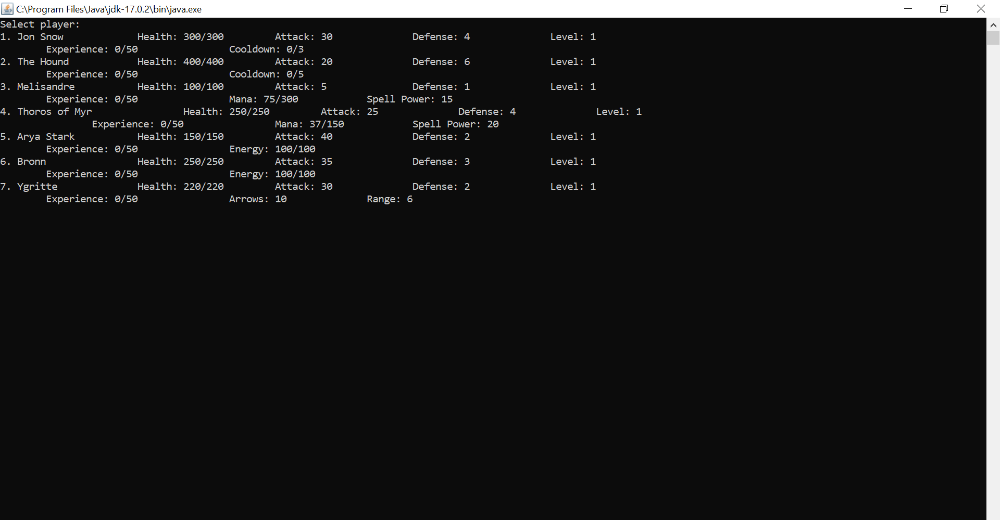
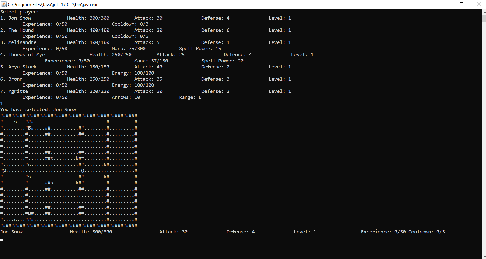
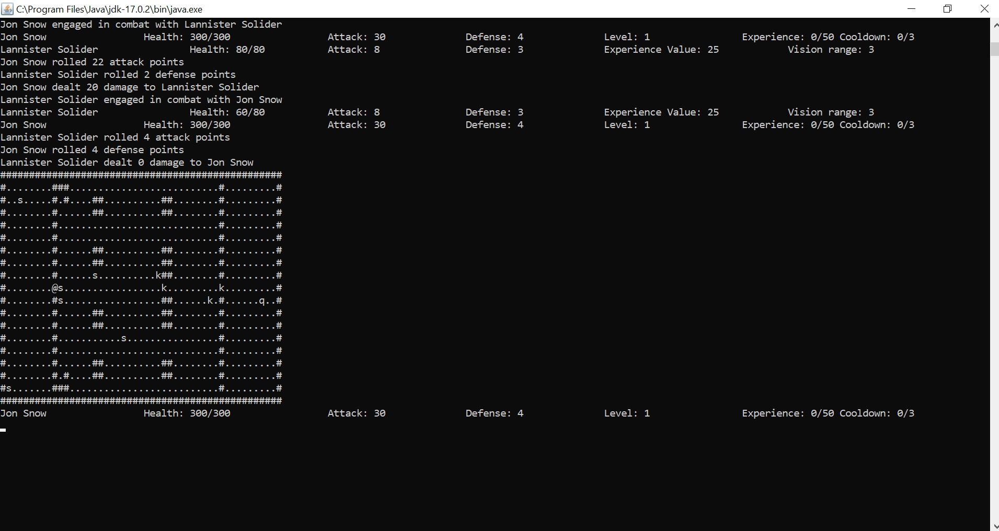
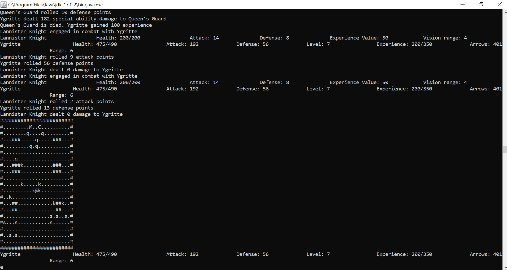

# Simple D&D game - Game of Thrones inspired theme.
The game is turn based and has 4 game levels.
## The game includes:
### 7 Heros: 
1. Jon Snow - Warrior
2. The Hound - Warrior
3. Melisandre - Mage
4. Thoros of Myr - Mage
5. Arya Stark - Rogue
6. Bronn -Rogue
7. Ygritte - Hunter

Each hero class has it's own special ability and each hero has a different stats.

### 3 Enemy Types:
- Boss:
1. The Mountain
2. Queen Cersei
3. Night's King
- Monster:
1. Lannister Solider
2. Lannister Knight
3. Queen's Guard
4. Wright
5. Bear-Wright
6. Giant-Wright
7. White Walker
- Trap:
1. Bonus Trap
2. Queen's Trap
3. Death Trap

The Boss is a special enemy that has a special ability cast.
The Traps are special enemies that can't move and are invisible most of the time.

## To run the game:
1. Download the DangeonsAndDragons.jar file.
2. Run the DangeonsAndDragons.jar file.

## How to play:
1. Select the character by choosing the corresponding number 
2. Controls:
- Go up: W
- Go down: S
- Go right: D
- Go left: A
- Cast Special Ability: E
- Do nothing: Q

* If you have a problem running it via double clicking check that you hava Java and JDK installed and try to run it via cmd by the next command:
java -jar DangeonsAndDragons.jar

